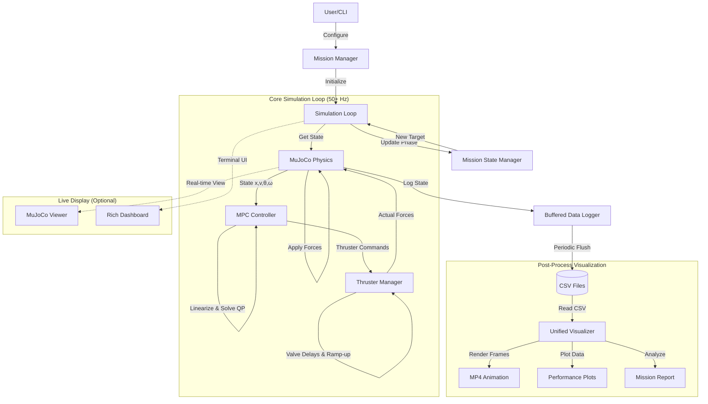

# Satellite Thruster Control System - Architecture Documentation

This document provides a complete file listing and description of the system architecture. For project overview and features, see [README](../README.md).

> **Note:** This project focuses on high-fidelity simulation using MuJoCo with OSQP-based Model Predictive Control.

---

## Directory Structure

```
Satellite_3D_MuJoCo/
│
├── run_simulation.py                 # Main Entry Point (delegates to CLI)
│
├── src/
│   └── satellite_control/            # Main Package
│       │
│       ├── cli.py                    # Command-Line Interface (Typer)
│       │
│       ├── core/                     # Core Simulation & Physics
│       │   ├── simulation.py         # Main Simulation Engine
│       │   ├── simulation_runner.py  # Simulation Execution Wrapper
│       │   ├── simulation_context.py # Simulation Context Object
│       │   ├── simulation_logger.py  # Real-Time Terminal Dashboard
│       │   ├── simulation_io.py      # File I/O Operations
│       │   ├── simulation_constants.py # Core Constants
│       │   ├── mujoco_satellite.py   # MuJoCo Physics Wrapper
│       │   ├── model.py              # Satellite Physics Model
│       │   ├── thruster_manager.py   # Thruster Valve & PWM Logic
│       │   ├── mpc_runner.py         # MPC Execution Loop
│       │   ├── interfaces.py         # Protocol Definitions
│       │   └── exceptions.py         # Custom Exceptions
│       │
│       ├── control/                  # Control Algorithms
│       │   └── mpc_controller.py     # MPC Optimizer (OSQP)
│       │
│       ├── mission/                  # Mission Logic & UI
│       │   ├── mission_manager.py    # Mission Orchestration
│       │   ├── mission_state_manager.py # State Machine & Phase Logic
│       │   ├── mission_report_generator.py # Post-Mission Analysis
│       │   ├── mission_logic.py      # Mission Type Definitions
│       │   ├── mission_handler_base.py # Base Handler Class
│       │   ├── interactive_cli.py    # Modern Interactive Menu (Questionary)
│       │   └── mission_cli.py        # Classic Text-Based Menu
│       │
│       ├── visualization/            # Rendering & Output
│       │   ├── unified_visualizer.py # Post-Process MP4 & Plot Generation
│       │   ├── simulation_visualization.py # Live MuJoCo Viewer Logic
│       │   └── satellite_2d_diagram.py # 2D Satellite Diagram Helpers
│       │
│       ├── utils/                    # Utilities
│       │   ├── data_logger.py        # Buffered CSV Logger
│       │   ├── logging_config.py     # Logging Setup
│       │   ├── navigation_utils.py   # Geometric Helpers
│       │   ├── simulation_state_validator.py # State Validation
│       │   ├── profiler.py           # Performance Profiling
│       │   ├── spline_path.py        # Spline Path Generation
│       │   ├── state_converter.py    # State Conversion Utilities
│       │   └── viewer_overlay.py     # MuJoCo Viewer Overlays
│       │
│       ├── config/                   # Configuration
│       │   ├── satellite_config.py   # Main Config Interface
│       │   ├── mpc_params.py         # MPC Tuning Parameters
│       │   ├── physics.py            # Physical Constants
│       │   ├── timing.py             # Timing Parameters
│       │   ├── mission_state.py      # Runtime Mission State
│       │   ├── models.py             # Pydantic Config Models
│       │   ├── constants.py          # System-Wide Constants
│       │   ├── obstacles.py          # Obstacle Definitions
│       │   └── thruster_config.py    # Thruster Configuration
│       │
│       └── testing/                  # Test Utilities
│           └── ... (test helpers)
│
├── docs/                             # Documentation
│   ├── ARCHITECTURE.md               # This file
│   ├── MATHEMATICS.md                # Mathematical Formulation
│   ├── DEVELOPMENT_GUIDE.md          # Developer Guide
│   ├── TESTING.md                    # Testing Documentation
│   └── ... (other docs)
│
├── Data/                             # Output Directory
│   └── Simulation/                   # Logs, Videos, Reports
│       └── [timestamp]/              # Per-run output
│           ├── simulation_data.csv
│           ├── Simulation_animation.mp4
│           └── mission_summary.txt
│
├── models/                           # MuJoCo Model Files
│   └── satellite_model.xml
│
├── DXF/                              # Custom Shape Files
│
└── tests/                            # Test Suite
    ├── e2e/                          # End-to-End Tests
    ├── unit/                         # Unit Tests
    └── integration/                  # Integration Tests
```

---

## Key Architectural Improvements

1. **Modular Package Structure**: All source code is encapsulated within `src/satellite_control`, separated into semantic subpackages (`core`, `control`, `mission`, `visualization`, `utils`, `config`).

2. **Performance-Optimized MPC**: The MPC controller uses a **persistent OSQP solver** with matrix warm-starting, achieving solve times of **~1-2ms** per timestep.

3. **Memory-Efficient Logging**: Buffered CSV writing prevents RAM exhaustion during long simulations, with configurable flush intervals.

4. **Decoupled Visualization**: Post-process visualization reads from CSV files, ensuring the physics loop is never blocked by rendering overhead.

5. **Rich Terminal UI**: Live dashboard using `rich` library with real-time telemetry, thruster status, and mission phase information.

6. **Interactive CLI**: Modern menu system using `questionary` for arrow-key navigation and visual mission configuration.

---

## Component Descriptions

### Entry Point

| File                | Purpose                                                                              |
| ------------------- | ------------------------------------------------------------------------------------ |
| `run_simulation.py` | Lightweight entry point that delegates to the CLI module for backward compatibility. |
| `cli.py`            | Main CLI interface using Typer. Provides `run`, `verify`, and `config` commands.     |

### Core (`src/satellite_control/core`)

The simulation engine and physics integration.

| File                      | Purpose                                                                                                |
| ------------------------- | ------------------------------------------------------------------------------------------------------ |
| `simulation.py`           | **The heartbeat.** Main simulation loop coordinating physics, control, logging, and visualization.     |
| `simulation_runner.py`    | High-level simulation execution wrapper with error handling and resource cleanup.                      |
| `simulation_context.py`   | Encapsulates simulation dependencies and runtime state in a single context object.                     |
| `simulation_logger.py`    | Real-time terminal dashboard displaying telemetry, thruster activity, and mission status using `rich`. |
| `simulation_io.py`        | Handles file I/O operations for saving simulation data and reports.                                    |
| `simulation_constants.py` | Core simulation constants and configuration values.                                                    |
| `mujoco_satellite.py`     | Low-level wrapper around MuJoCo physics engine. Handles force application and state retrieval.         |
| `model.py`                | Defines satellite physical properties (mass, inertia, thruster geometry) for controller and simulator. |
| `thruster_manager.py`     | Manages realistic thruster behavior including valve delays, thrust ramp-up, and PWM duty cycle logic.  |
| `mpc_runner.py`           | MPC execution loop that coordinates controller calls and command application.                          |
| `interfaces.py`           | Protocol definitions for clean component interfaces (runtime type checking).                           |
| `exceptions.py`           | Custom exception hierarchy for simulation error handling.                                              |

### Control (`src/satellite_control/control`)

| File                | Purpose                                                                                                                |
| ------------------- | ---------------------------------------------------------------------------------------------------------------------- |
| `mpc_controller.py` | **The Brain.** Linearized Model Predictive Controller using OSQP. Solves a quadratic program at every timestep (~2ms). |

### Mission (`src/satellite_control/mission`)

High-level mission orchestration and user interface.

| File                          | Purpose                                                                                    |
| ----------------------------- | ------------------------------------------------------------------------------------------ |
| `mission_manager.py`          | Coordinates mission setup, execution, and completion across different mission types.       |
| `mission_state_manager.py`    | State machine managing mission phases (e.g., "approaching waypoint", "stabilizing").       |
| `mission_report_generator.py` | Post-mission analysis generating detailed performance reports with accuracy and stability. |
| `mission_logic.py`            | Defines mission type logic (Waypoint Navigation, Shape Following, etc.).                   |
| `mission_handler_base.py`     | Base class for mission-specific handlers.                                                  |
| `interactive_cli.py`          | Modern interactive menu using `questionary` for styled, arrow-key navigation.              |
| `mission_cli.py`              | Classic text-based menu interface (fallback).                                              |

### Visualization (`src/satellite_control/visualization`)

| File                          | Purpose                                                                                                |
| ----------------------------- | ------------------------------------------------------------------------------------------------------ |
| `unified_visualizer.py`       | Post-process visualization engine. Generates high-quality MP4 animations and matplotlib plots from CSV |
| `simulation_visualization.py` | Live visualization coordinator during simulation runtime. Manages MuJoCo viewer updates.               |
| `satellite_2d_diagram.py`     | Utility functions for drawing 2D satellite diagrams and trajectory plots.                              |

### Configuration (`src/satellite_control/config`)

Centralized configuration using dataclasses and Pydantic models.

| File                  | Purpose                                                                            |
| --------------------- | ---------------------------------------------------------------------------------- |
| `satellite_config.py` | **Main config interface.** Central hub for accessing all subsystem configurations. |
| `mpc_params.py`       | MPC tuning parameters (prediction horizon, control weights, constraints).          |
| `physics.py`          | Physical constants (mass, inertia, thruster force, damping coefficients).          |
| `timing.py`           | Timing parameters (timestep, control update rate, max simulation time).            |
| `mission_state.py`    | Runtime mission state (current waypoint, trajectory, mission phase).               |
| `models.py`           | Pydantic models for typed configuration with validation.                           |
| `constants.py`        | System-wide constants (coordinate systems, conversion factors).                    |
| `obstacles.py`        | Obstacle definitions and presets (positions, radii, safety margins).               |
| `thruster_config.py`  | Thruster physical configuration (positions, orientations, valve characteristics).  |

### Utilities (`src/satellite_control/utils`)

| File                            | Purpose                                                                             |
| ------------------------------- | ----------------------------------------------------------------------------------- |
| `data_logger.py`                | High-performance buffered CSV logger with configurable flush intervals.             |
| `logging_config.py`             | Python logging configuration for file and console output.                           |
| `navigation_utils.py`           | Geometric utility functions (distance, angle wrapping, coordinate transformations). |
| `simulation_state_validator.py` | Validates simulation state for numerical stability and physical plausibility.       |
| `profiler.py`                   | Performance profiling utilities with histogram generation and timing statistics.    |
| `spline_path.py`                | Cubic spline path generation for smooth trajectory following.                       |
| `state_converter.py`            | State vector conversion utilities between different representations.                |
| `viewer_overlay.py`             | Text overlay rendering for MuJoCo viewer (telemetry display).                       |

---

## Data Flow Architecture



---

## Key Workflows

### Running a Simulation

1. **Launch**: User runs `python run_simulation.py` (or `python -m src.satellite_control.cli run`)
2. **Configuration**:
   - Interactive menu (questionary) or classic text menu
   - User selects mission type and parameters
   - Configuration applied to `SatelliteConfig`
3. **Initialization**:
   - `Simulation` object created
   - MuJoCo physics engine initialized with satellite model
   - `MPCController` sets up persistent OSQP solver environment
   - `ThrusterManager` initializes valve delay queues
4. **Simulation Loop** (runs at physics timestep, typically 50-200 Hz):
   - **Step 1**: Retrieve current state from MuJoCo (`position`, `velocity`, `angle`, `angular_velocity`)
   - **Step 2**: `MissionStateManager` updates current target based on mission phase
   - **Step 3**: `MPCController` linearizes dynamics around current state and solves optimal control problem (~1-2ms)
   - **Step 4**: Thruster commands sent to `ThrusterManager`
   - **Step 5**: `ThrusterManager` processes valve delays and thrust ramp-up
   - **Step 6**: Actual thruster forces applied to physics engine
   - **Step 7**: State and controls buffered in `DataLogger`
   - **Step 8**: Live dashboard updated with current telemetry
5. **Completion**:
   - `DataLogger` flushes remaining data to `simulation_data.csv`
   - `MissionReportGenerator` analyzes trajectory and creates `mission_summary.txt`
   - `UnifiedVisualizer` generates `Simulation_animation.mp4` and performance plots from CSV
   - Resources cleaned up (MuJoCo model, file handles, etc.)

### Testing & Verification

The project includes comprehensive test coverage:

- **Unit Tests**: Test individual components in isolation
- **Integration Tests**: Test component interactions
- **End-to-End Tests**: Full simulation runs with validation
- **Property-Based Tests**: Hypothesis-driven testing for edge cases

Run tests via:

```bash
python run_simulation.py verify              # Quick E2E tests
python run_simulation.py verify --full       # Full test suite
pytest tests/                                # Direct pytest invocation
```

---

## Performance Characteristics

| Component            | Performance Metric                  |
| -------------------- | ----------------------------------- |
| MPC Solve Time       | ~1-2ms per timestep (OSQP)          |
| Physics Timestep     | 0.01-0.02s (configurable)           |
| Control Update Rate  | 50-100 Hz                           |
| CSV Write Latency    | Buffered, ~1s flush interval        |
| Memory Usage         | <100MB for 10-minute simulation     |
| Animation Generation | ~30 seconds for 5-minute simulation |

---

## Design Principles

1. **Separation of Concerns**: Physics, control, visualization, and mission logic are cleanly separated
2. **Performance First**: Critical loops optimized, with profiling infrastructure built-in
3. **Type Safety**: Comprehensive type hints with mypy validation
4. **Testability**: Protocol-based interfaces enable easy mocking and testing
5. **Configurability**: All parameters accessible via `SatelliteConfig` hierarchy
6. **Professional UX**: Rich terminal UI and interactive menus for excellent developer experience

---

## Extension Points

To extend the system:

- **New Mission Types**: Implement in `mission_logic.py` and add to `mission_manager.py`
- **Alternative Controllers**: Implement control protocol in `interfaces.py`
- **Custom Visualizations**: Extend `UnifiedVisualizer` with new plot types
- **Different Physics**: Implement physics protocol for alternative backends
- **Advanced Profiling**: Add instrumentation points in `profiler.py`

---

## References

- [MuJoCo Documentation](https://mujoco.readthedocs.io/)
- [OSQP Documentation](https://osqp.org/)
- [Mathematical Formulation](MATHEMATICS.md)
- [Development Guide](DEVELOPMENT_GUIDE.md)
